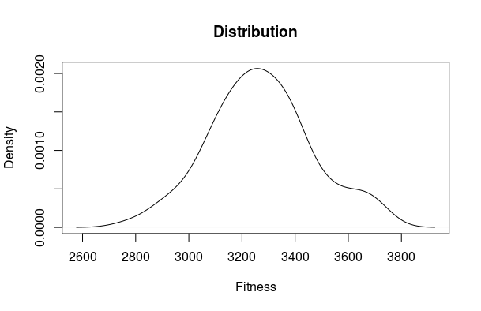

## Summary of Algorithm

* Tournament parent selection
  * **20** tournaments
  * **5** participants in each tournament 
* Partially mapped crossover recombination
* Pure elitism survivor selection
  * The best children plus a few randomly selected ones are added to the survivors
* Mutation through inversion
  * Replace the worst children with the best mutants
* Heursistically choose **initial** population
  * The inital population is chosen by randomly selecting the first element of the *cityList*
  * The second element is the one that has the lowest proximity to the first
  * The third is the element from the remaining list that has the lowest proximity to the second
  * This continues until the end of the list is reached 

## Experiment Result

The code can be built and run in the following manner

```sh
$ make
$ make run
```

The results of running the code were as follows.

```
Lowest: 2775.0
Average: 3272.13
Highest: 3728.0
```

A plot of the results can be seen in the figure bellow



## Shapiro-Wilk Normality Test

Shapiro Wilk normality test was performed to assertain whether our set of solutions had an underlying normal distribution. The following tests in `R` were performed on our data

```R
data = scan('results.out', skip=1)
shapiro.test(data)
```

The test resulted in the following output

```R
data:  data
W = 0.98383, p-value = 0.2608
```

With a statistical significance of *0.05* we cannot reject the hypothesis that our sample does not come from a population that is normally distributed. 

## Comparison With Classmate

### Classmate Details

| Name          | Student Number |
| ------------- | -------------- |
| Erin Versfeld | Vrseri001      |

### Statistical Significance Test

The following `R` code was run to perform the statistical test

```R
data = scan('./results.out', skip=1)
erinsdata = scan('./results-erin.out', skip=1)
t.test(data, erinsdata)
```

This yielded the following output

```R
data:  data and erindata
t = 2.0494, df = 197.99, p-value = 0.04174
alternative hypothesis: true difference in means is not equal to 0
95 percent confidence interval:
   2.14611 111.49389
sample estimates:
mean of x mean of y 
  3272.13   3215.31 
```

Our null hypothisis $H_0$ is that our two algorithms have the same performance and thus sample mean. With a *p-value* of *0.04174* we can reject the null hypothesis that our results means have the same mean with a statistical power $\alpha$ of $\alpha < 0.05$ . From this we can conclude that Erins solution slightly outperforms my solution. 

### Explanation

The differences between solutions can be summarised by the following table:

| Category           | Jonah                            | Erin                        |
| ------------------ | -------------------------------- | --------------------------- |
| Parent Selection   | Tournament                       | None                        |
| Recombination      | Partially Mapped CrossOver (Pmx) | None                        |
| Survivor Selection | Elitism with some randomness     | None                        |
| Mutation           | Inversion                        | Inversion                   |
| Heuristic          | Nearset neighbour city sort      | Nearest neighbour city Sort |

There is a slight difference in the performance of our algorithms. My solution introduces a small number of poorer solutions as part of it's survivor selection. It also makes use of tournament selection and also some recombination. As a result the solution seems to introduce slightly more poor solutions in persuit of exploration rather than exploitation. The difference between the solutions is small because the underlying techniques that they use are similar. The **heuristic** and **inversion mutation** are extremely powerful at obtaining a good solution very quickly before cities move. Due to the rapidity at which the cities change there is little time to create a superior solution from a more diverse population of solutions. Overall, that could account for the small but noticable differences in performance between our algorithms. 